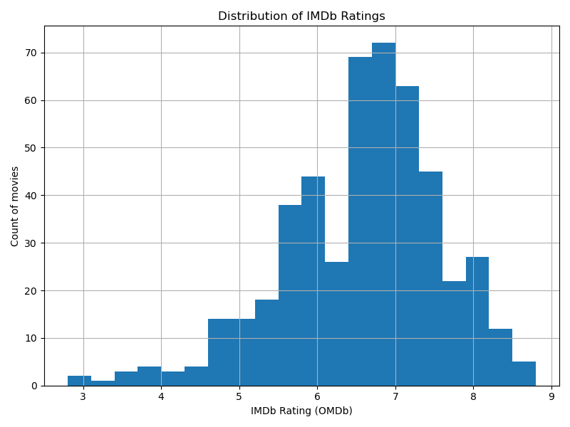
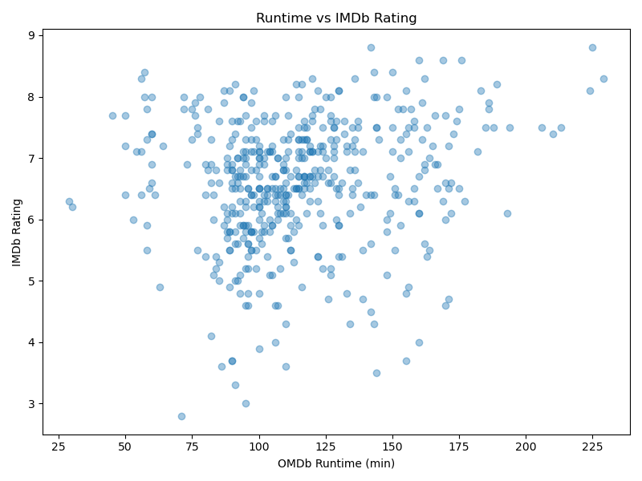
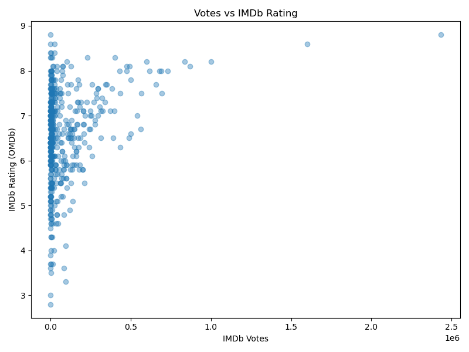
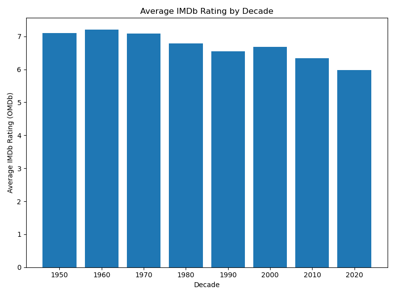

# Findings

Once the data was finally cleaned, we then went on to merge, hash, validate, and push everything through our Snakemake pipeline. After this was done, we were able to look at the data itself. From this analysis of the 500 merged observations, we were able to see a bunch of consistent trends in the data. We looked at how ratings changed across genres, decades, and other key areas of interest.

To start, the summary statistics for our main variables confirmed what we later saw in the visualizations.

**Summary Statistics**  
[`results/summary_stats.csv`](results/summary_stats.csv)

---

The first thing that stood out was just how evenly distributed IMDb ratings look when you plot them. The histogram of `imdbRating_clean` shows a tight distribution centered around 6 and 7, which matches the general opinion and understanding that most movies are "fine," a few are really bad, and only a handful break into the premium 8 and 9 range. The summary statistics back this up. The average OMDb rating in our sample was 6.58, with a minimum of 2.8 and a maximum of 8.8.

**Figure: Distribution of IMDb Ratings**  

---

The correlations showed some strong and telling relationships. The biggest one was seen between Metascore and IMDb rating (r ≈ 0.71). When you look at the scatterplot, it supports this. As critic scores increase, so do audience scores. This makes sense as good movies are often subjectively positive across all different types of audiences. The second strongest correlation was between Netflix's stored rating (`imdb_score`) and OMDb's IMDb rating (r ≈ 0.97). This tells us that the time at which the Netflix scores were captured has not altered much, and the value they store is something pretty close to what IMDb has currently, even though that data is dynamically fetched.

**Correlation Matrix**  
[`results/correlation_matrix.csv`](results/correlation_matrix.csv)

**Figure: Metascore vs IMDb Rating**  

---

Vote count had a smaller positive correlation with a rating of (r ≈ 0.29). The scatterplot visualization shows a very wide range of votes, where some movies get over a million votes, but others can barely break into four digits. Movies tend to get more attention and receive a higher rating, but that is not always the case. There are also plenty of average-rated movies with large vote counts, possibly due to their popularity or how long they have been out. We can see that the runtime also showed a weak correlation of only (r ≈ 0.16). This means that watching a three-hour movie did not guarantee a better rating. Through our work, there are plenty of examples of some of the highest-rated movies being significantly shorter while still maintaining higher ratings.

**Figure: Runtime vs IMDb Rating**  

**Figure: Votes vs IMDb Rating**  

---

Our awards analysis was very interesting and a little surprising. Movies that received awards had an average score of 6.70, coming in slightly higher than the 6.25 rating for films without awards. It is not a large difference, but it is substantial enough to show that awards do matter on average. It begs the question of how global recognition changes after awards. We see a trend that shows awards lead to more positive ratings in the long run due to the large audience that comes with it.

**Awards Rating Summary**  
[`results/award_rating_summary.csv`](results/award_rating_summary.csv)

---

The decade trends were probably the most interesting to look at. Even with the smaller sample size, which does impact our analysis, the average IMDb ratings were highest in the 1960s (7.20) and have been sloping downward ever since. This could also come with the increase in interest in the system, and over time, the rating system will become more difficult with more and more movies being added. With movies in the 2020s averaging only 5.98 so far. It could be that audiences are harsher or studios are more money-driven and focused on algorithms, or maybe that people are no longer going to theaters as much. Streaming has changed the game for better or worse. Regardless of the reason, it is clear that older movies in our data have tended to be rated higher than the newer ones.

**Figure: Average Rating by Decade**  

**Decade Summary Table**  
[`results/rating_by_decade.csv`](results/rating_by_decade.csv)

---

Overall, the strongest influences of higher IMDb ratings were Metascore, awards, and being released in an earlier decade. Runtime and popularity help a little bit, but they were not super strong predictors on their own.